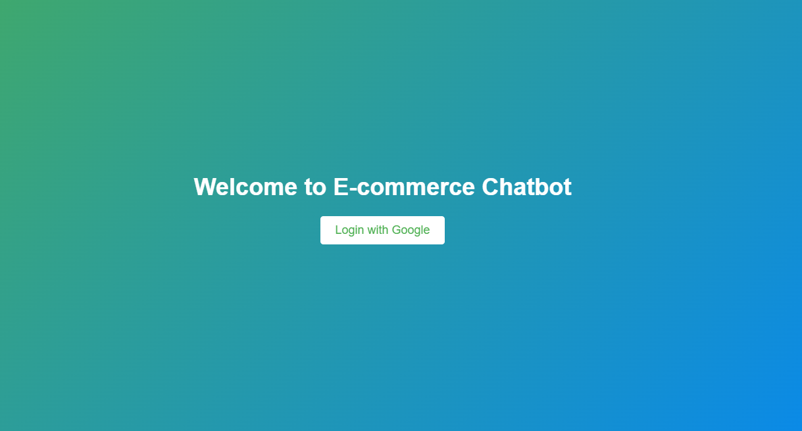
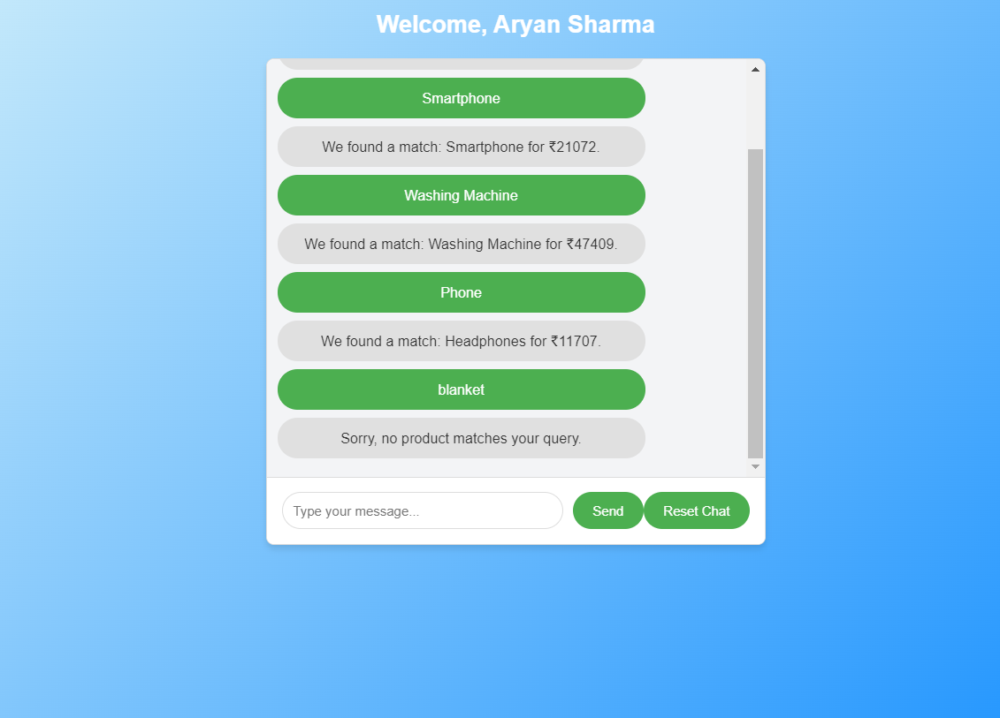

# E-commerce Sales Chatbot

This project implements an interactive e-commerce sales chatbot designed to improve the shopping experience. The chatbot allows users to search, explore, and interact with products via a simple, intuitive interface.

---

## Features

- Responsive UI compatible with desktop, tablet, and mobile devices.
- Google Login for secure user sessions.
- Product search functionality via chatbot interface.
- Conversation reset and session persistence.
- Flask-based backend for product data fetching.
- Mock database with 100+ e-commerce product entries.

---

## Technologies Used

### Frontend:
- React (JavaScript)
- Firebase Authentication
- Responsive design with modern CSS

### Backend:
- Flask (Python)
- RESTful API

### Database:
- Mock JSON-based data with 100+ product entries

---

## Setup Instructions

### Backend:
1. Navigate to the `backend` folder:
   ```bash
   cd backend
   ```
2. Install Python dependencies:
   ```bash
   pip install flask flask-cors
   ```
3. Run the Flask server:
   ```bash
   python app.py
   ```

### Frontend:
1. Navigate to the `frontend` folder:
   ```bash
   cd ecommerce-chatbot
   ```
2. Install Node.js dependencies:
   ```bash
   npm install
   ```
3. Start the React development server:
   ```bash
   npm start
   ```

---

## API Endpoints

- **GET /products**: Returns the list of all products.
  Example response:
  ```json
  [
    { "id": 1, "name": "Laptop", "category": "Electronics", "price": 50000 },
    { "id": 2, "name": "Smartphone", "category": "Electronics", "price": 20000 }
  ]
  ```

---

## Challenges Faced

1. **Login Authentication**:
   - Difficulty integrating Google Login with React.  
   - Solution: Firebase Authentication with Google Provider simplified the process.  

2. **Session Persistence**:
   - Maintaining chat history across sessions.  
   - Solution: Used `localStorage` to store messages.  

3. **Mock Data Generation**:
   - Generating a realistic dataset for the mock e-commerce platform.  
   - Solution: Used custom scripts and tools like Mockaroo.

---

## Screenshots

### Login Screen:


### Chatbot Interface:


---

## Authors

- Aryan Sharma
